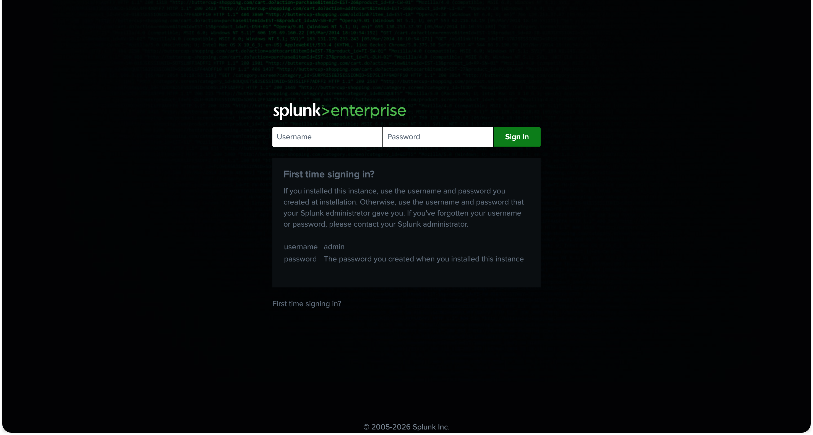
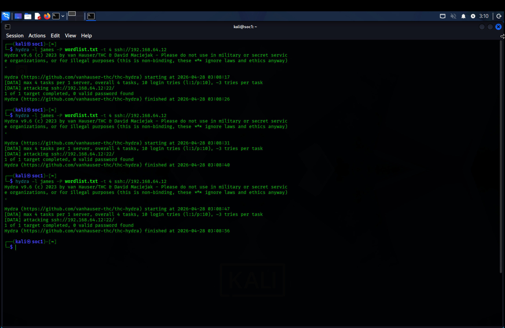
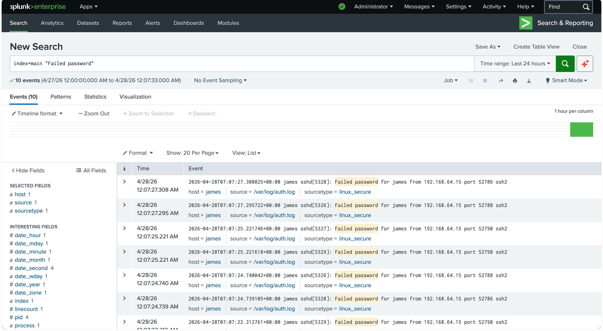
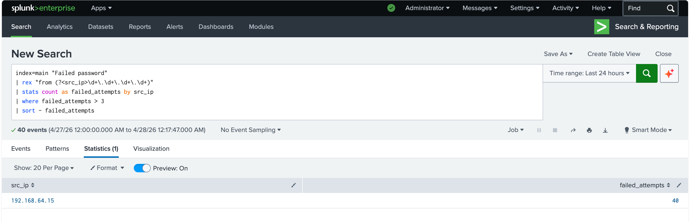
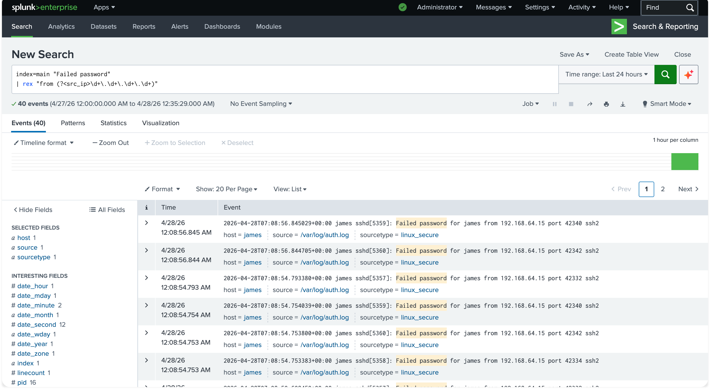
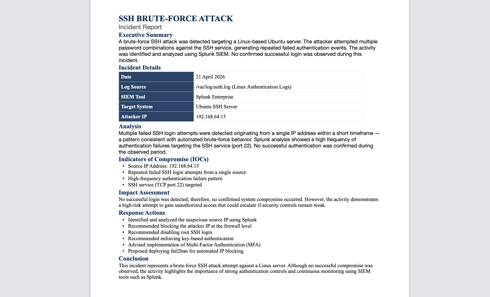

# Day 01 – SSH Brute Force Detection (Splunk)

## Overview

This project demonstrates the detection of an SSH brute force attack using Splunk SIEM in a controlled lab environment. It follows a typical SOC workflow: log ingestion, detection, investigation, and incident reporting.

---

## Objective

To identify SSH brute force activity by analyzing authentication logs and detecting repeated failed login attempts from a single source within a defined timeframe.

---

## Architecture
> Logs (Ubuntu / Auth.log)
        ↓
Splunk Ingestion
        ↓
Detection Query
        ↓
Alert Triggered
        ↓
SOC Analyst Review
        ↓
Investigation & Reporting


**Flow:** Attacker (Kali Linux) → Target (Ubuntu SSH Server) → Splunk SIEM → Analyst Investigation

---

## What is an SSH Brute Force Attack?

An SSH brute force attack is a technique where an attacker attempts to gain unauthorized access by systematically trying multiple username and password combinations over SSH.

---

## Tools Used

* Splunk Enterprise (SIEM)
* Ubuntu Server (SSH target)
* Kali Linux (attack simulation using Hydra)
* SSH authentication logs (`/var/log/auth.log`)

---

## Project Workflow / Methodology

### 1. Setup



* Configured SSH service on Ubuntu server
* Created test user accounts for authentication testing
* Installed Splunk Enterprise for log analysis
* Configured Splunk Universal Forwarder to ingest logs

---

### 2. Attack Simulation



* Executed Hydra from Kali Linux to simulate a brute force attack
* Generated multiple failed SSH login attempts against the target system

---

### 3. Log Ingestion



* Forwarded `/var/log/auth.log` into Splunk
* Verified successful ingestion using `index=main`

---

### 4. Detection



#### Detection Logic

A brute force attack is suspected when:

* Multiple failed login attempts occur
* Attempts originate from the same source IP
* Activity happens within a short time window

#### Splunk Query

```spl
index=main "Failed password"
| rex "from (?<src_ip>\d+\.\d+\.\d+\.\d+)"
| stats count as failed_attempts by src_ip
| where failed_attempts > 3
| sort - failed_attempts
```

#### Explanation

* Extracts source IP from authentication logs
* Aggregates failed login attempts per IP
* Flags IPs exceeding the defined threshold

---

### 5. Investigation



* Identified the top offending source IP based on failed attempts
* Reviewed event timestamps to confirm rapid succession of login failures
* Checked for any successful authentication following failed attempts
* Validated that activity aligns with brute force attack behavior

---

### 6. Findings

* A single source IP generated a high volume of failed SSH login attempts
* Activity occurred within a short time interval, indicating automated attack behavior
* No successful login was observed during the attack window
* Targeted accounts included valid system users, increasing risk exposure

---

### 7. MITRE ATT&CK Mapping

| Behavior                  | Technique | Description                    |
| ------------------------- | --------- | ------------------------------ |
| Failed SSH login attempts | T1110.001 | Brute Force: Password Guessing |
| SSH access attempt        | T1021.004 | Remote Services: SSH           |
| Potential account use     | T1078     | Valid Accounts                 |

---

### 8. Incident Summary



* **Incident Type:** SSH Brute Force Attack
* **Severity:** High
* **Detection Method:** Splunk search query
* **Status:** Detected and analyzed (no confirmed compromise)

---

### 9. SOC Analyst Insight

This activity highlights how attackers rely on automation to exploit weak authentication controls. Monitoring authentication logs and applying aggregation-based detection enables early identification of brute force attempts before account compromise occurs.

In a real SOC environment, such activity would typically trigger alerts and may require immediate containment actions, such as blocking the source IP.

---

### 10. Recommendations

* Disable direct root SSH login
* Enforce SSH key-based authentication
* Implement multi-factor authentication (MFA)
* Deploy tools like fail2ban to block repeated failed attempts
* Configure real-time alerting in Splunk for authentication anomalies

---

## Repository Structure

```
.
├── images/
│   ├── architecture_diagram.png
│   ├── 01_setup.png
│   ├── 02_attack.png
│   ├── 03_ingestion.png
│   ├── 04_detection.png
│   ├── 05_investigation.png
│   ├── 06_incident_report.png
│
├── logs.txt
├── splunk_queries.md
├── README.md
```

---

## Conclusion

This project demonstrates how SSH brute force attacks can be detected using Splunk by analyzing authentication logs and identifying abnormal login patterns. It reflects key SOC responsibilities, including log monitoring, threat detection, and incident analysis.

---
