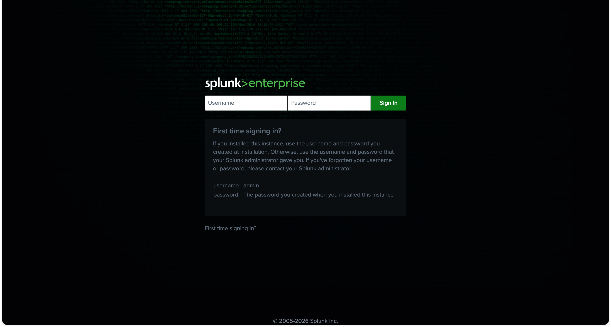
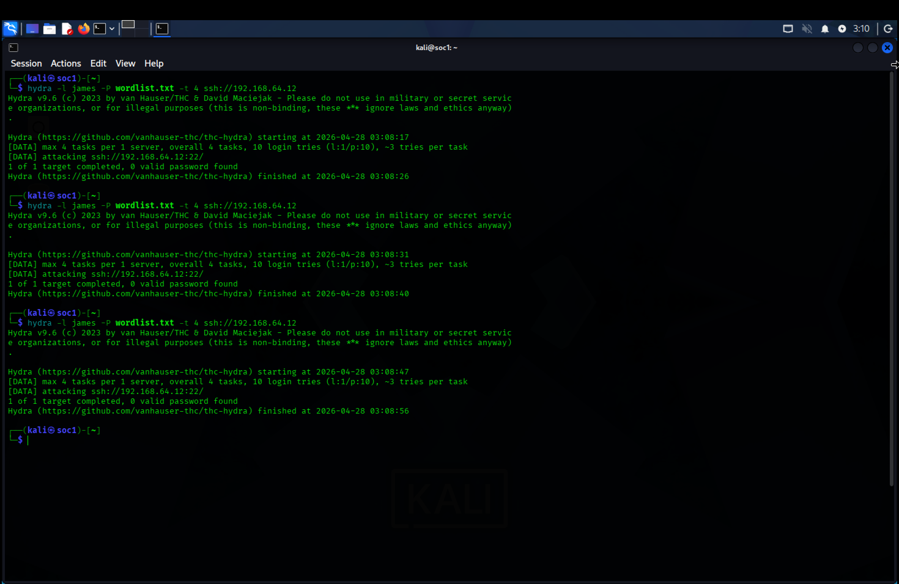
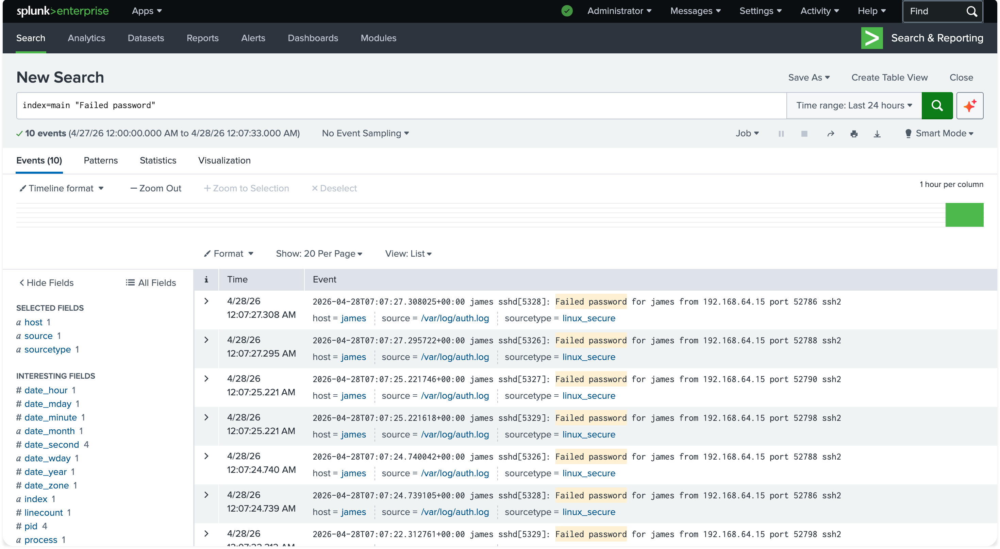
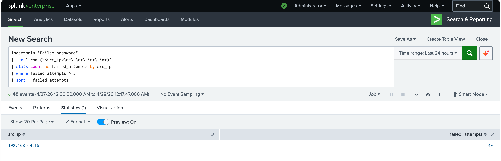
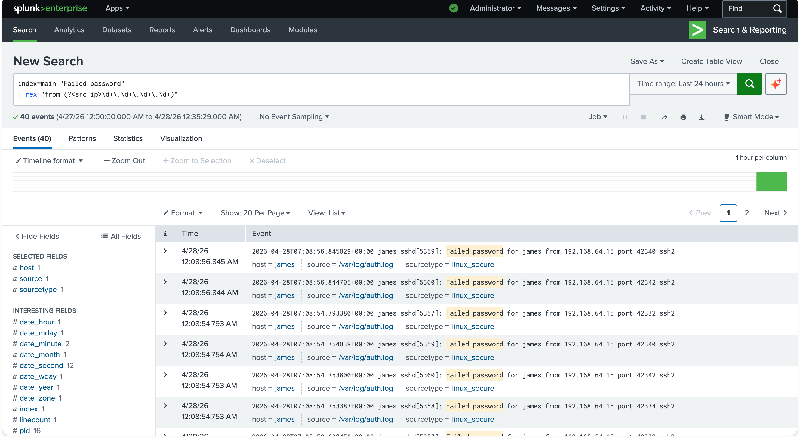

# SSH Brute Force Detection with Splunk

Detecting SSH brute force activity in Splunk using Linux authentication logs and investigating whether a successful login followed.


Hydra generated repeated SSH authentication attempts from Kali Linux against the Ubuntu server. Authentication logs from the target were then analyzed in Splunk.

## At a Glance

| Field | Detail |
| --- | --- |
| Attack Type | SSH brute force |
| Detection Platform | Splunk Enterprise |
| Log Source | `/var/log/auth.log` |
| Target | Ubuntu Server, SSH enabled |
| Attack Source | Kali Linux running Hydra |
| Outcome | Attack detected, no successful login observed in the attack window |
| Primary MITRE ATT&CK | T1110.001 — Password Guessing |

## What This Is

This is a controlled SOC lab that simulates SSH password guessing against an Ubuntu server.

Hydra generated the authentication attempts. The resulting Linux authentication logs were forwarded into Splunk for detection and investigation.

The goal was not only to find failed logins. It was to determine what happened after the failures and whether the available evidence showed a successful authentication.

## What Happened

An automated password guessing attack was run against the SSH service on the Ubuntu server.

The activity created repeated failed authentication events in `/var/log/auth.log`.

Those logs were forwarded into Splunk, where the events could be searched, grouped by source IP, and investigated.

The investigation then checked whether successful authentication from the same source followed the failures.

## Environment Setup



The Ubuntu target had SSH enabled and test user accounts available.

Splunk Enterprise was used for analysis, with the Splunk Universal Forwarder shipping the authentication log to the indexer.

This created the basic evidence path:

**SSH activity → authentication log → Splunk**

**Verdict:** The environment provided the telemetry needed to investigate SSH authentication activity.

## Attack Simulation



Hydra was run from Kali Linux against the Ubuntu SSH service.

It generated repeated authentication attempts against valid and invalid usernames.

This produced the failed login activity needed for the investigation.

**Verdict:** The controlled simulation generated repeated SSH authentication failures for analysis.

## Log Ingestion



Before writing detection logic, the authentication data was checked in Splunk.

```spl
index=main
```

Authentication events were visible in the index.

This step matters because a detection query cannot find activity that was never collected.

**Verdict:** The authentication telemetry was available in Splunk before detection work started.

## Detection Logic

A single failed login is weak evidence by itself.

The stronger signal is repeated authentication failures from the same source.

The investigation therefore looked for:

- multiple failed SSH authentication attempts
- repeated activity from the same source IP
- a high volume of failures during the investigated activity

## Detection Query



```spl
index=main "Failed password"
| rex "from (?<src_ip>\d+\.\d+\.\d+\.\d+)"
| stats count as failed_attempts by src_ip
| where failed_attempts > 3
| sort - failed_attempts
```

The source IP was stored inside the raw SSH event, so it first needed to be extracted.

`rex` creates the `src_ip` field.

`stats` groups the failed authentication events by source IP and counts them.

The final filter keeps sources with more than three failures.

This turns individual authentication events into a pattern that is easier to investigate.

**Verdict:** The SPL identified a source responsible for repeated failed SSH authentication attempts.

## Investigation Findings



The detection search identified one source IP responsible for a high volume of failed authentication attempts.

Finding the failures was only the first step.

The same authentication data was then checked for successful logins from that source after the failed attempts.

No successful authentication from that source was observed during the investigated attack window.

That negative finding matters because it helps separate an attempted credential attack from evidence of a successful SSH login.

**Verdict:** SSH password guessing was observed, but the available authentication evidence did not show a successful login from the attacking source during the investigated window.

## Indicators Observed

| Indicator | Observation |
| --- | --- |
| Authentication failures | High volume of failed SSH authentication events |
| Source pattern | Repeated attempts from a single source IP |
| Attempt rate | Rapid authentication attempts during the simulated activity |
| Accounts | Valid and invalid usernames were targeted |
| Successful authentication | None observed from the attacking source during the investigated window |

## MITRE ATT&CK Mapping

| Behaviour | Technique ID | Description | Evidence Status |
| --- | --- | --- | --- |
| Password guessing | T1110.001 | Password Guessing | Observed |

T1110.001 is the primary mapping because the lab directly generated and observed repeated password guessing against SSH.

The investigation did not establish successful use of a valid account, so techniques requiring successful account use are not presented as confirmed behavior.

## Analyst Conclusion

The available evidence confirmed SSH password guessing from a single source.

Repeated authentication failures were visible in the Ubuntu authentication logs and could be grouped by source in Splunk.

No successful authentication from that source was observed during the investigated attack window.

The evidence therefore supports an attempted credential attack without evidence of a successful SSH login from that source during the investigated period.

## Recommended Response

For a similar event in a production environment, the first step would be to validate whether the source is expected and review successful authentication around the same period.

The targeted accounts should also be checked for suspicious activity.

Depending on the environment and confidence in the finding, response actions could include blocking the source, applying account protections, and creating an alert for repeated SSH authentication failures.

Continued monitoring would help identify whether the same source later produces successful authentication or other suspicious activity.

## The SOC Angle

The useful part of this lab is not simply generating failed SSH logins.

The investigation follows a repeatable SOC workflow:

**Generate activity → validate telemetry → detect the pattern → investigate the source → check for success → reach an evidence-based conclusion**

The same reasoning can be applied to many authentication alerts.

Finding suspicious activity starts the investigation. Checking what happened next helps determine its impact.

## Lessons Learned

This lab reinforced that detection starts with trustworthy telemetry.

Before building the SPL, the authentication events had to be visible in Splunk and the source IP had to be available for analysis. Without those pieces, repeated failures could not be reliably grouped back to their source.

It also reinforced the importance of checking what happened after the initial detection. Finding repeated failures confirmed the password guessing activity, but checking for successful authentication helped determine what the available evidence showed about its outcome.

The main lesson is simple: **detect the behavior, then investigate its impact.**

## What I'd Improve

In the next version, I would make the detection time-aware instead of counting failed logins only by source IP.

I would group failures into short time windows and test the threshold against normal SSH activity before turning the search into a Splunk alert.

I would also correlate repeated failures with any later successful authentication from the same source. This would help separate an unsuccessful password guessing attempt from activity that may require deeper investigation.

These improvements directly extend the same detection and investigation workflow used in this project.

## What This Demonstrates

This project demonstrates the ability to:

- validate authentication telemetry before relying on detection logic
- investigate Linux SSH authentication events in Splunk
- extract source IP information from raw events
- aggregate repeated failures into an investigation signal
- distinguish observed attack activity from evidence of successful authentication
- document positive and negative investigation findings
- map observed password guessing behavior to MITRE ATT&CK
- identify practical improvements to detection logic based on investigation findings

## Repository Structure

```text
├── README.md
├── images/
│   ├── 01_setup.png
│   ├── 02_attack.png
│   ├── 03_ingestion.png
│   ├── 04_detection.png
│   ├── 05_investigation.png
│   ├── 06_incident_report.png
├── logs.txt
├── splunk_queries.md
```

---

[](https://linkedin.com/in/WilliamInCyber)
[](https://x.com/WilliamInCyber)
